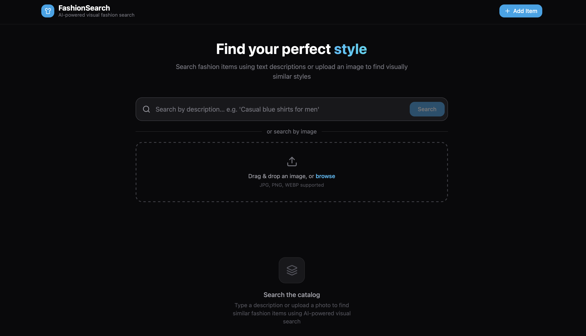
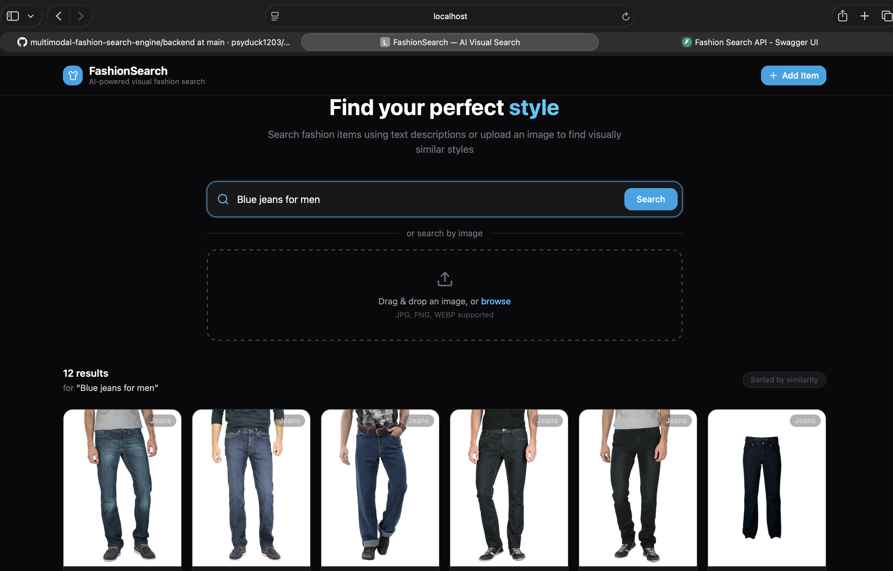
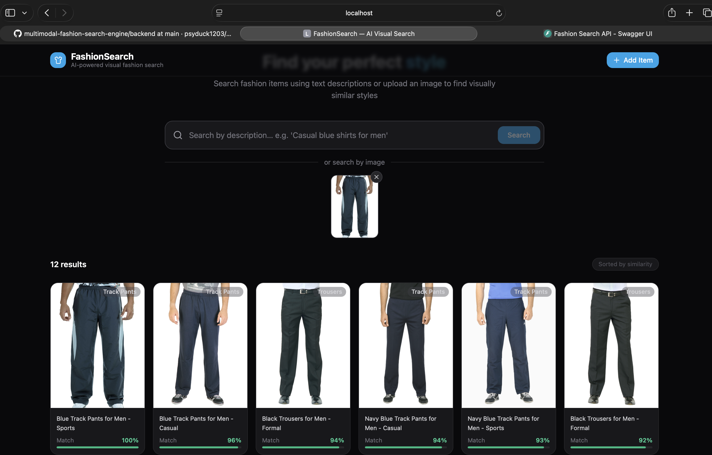

# FashionSearch — Multimodal AI Fashion Search Engine

A full-stack multimodal retrieval system that enables users to search fashion products using either natural language descriptions or uploaded images.

Built using CLIP embeddings, FAISS vector similarity search, FastAPI, React, and TypeScript.

---

## Architecture

```
        React Frontend
              │
              ▼
      FastAPI Backend
              │
  ┌───────────┴───────────┐
  ▼                       ▼
CLIP Embeddings     Metadata JSON DB
  │
  ▼
FAISS Index
  │
  ▼
Search Results
```

## Dataset

This project uses the Fashion Product Images Dataset from Kaggle: https://www.kaggle.com/datasets/paramaggarwal/fashion-product-images-dataset

The dataset contains fashion product images and metadata across multiple clothing categories. To keep the repository lightweight, the image dataset is not included in GitHub.

Download the dataset from Kaggle and place the images inside: data/images/

### Tech Stack
| Layer | Technology |
|---|---|
| Frontend | React 18, TypeScript, Tailwind CSS, Vite |
| Backend | FastAPI, Python 3.10+ |
| Embeddings | HuggingFace `openai/clip-vit-base-patch32` |
| Vector Search | FAISS (IndexFlatIP — cosine similarity) |
| Metadata Store | Local JSON file |

---

## Setup Instructions

### Prerequisites
- Python 3.10+
- Node.js 18+
- pip

### 1. Clone / download the project

```bash
git clone <repo-url>
cd fashion-search
```

### 2. Backend setup

```bash
cd backend
python -m venv venv
source venv/bin/activate   # Windows: venv\Scripts\activate
pip install -r requirements.txt
```

Copy and configure environment variables:
```bash
cp .env.example .env  # edit if needed
```

### 3. Frontend setup

From the project root:
```bash
npm install
```

Configure the API URL (already set in `.env`):
```
VITE_API_URL=http://localhost:8000
```

---

## Running Locally

### Start the backend

```bash
cd backend
uvicorn main:app --reload --host 0.0.0.0 --port 8000
```

On first startup the backend will:
1. Load the CLIP model (~340 MB, downloaded once from HuggingFace)
2. Load metadata from metadata.json
3. Generate CLIP embeddings for all images
4. Build and save the FAISS index to `faiss_index.bin`

This takes 1-3 minutes on the first run.

### Start the frontend

From the project root:
```bash
npm run dev
```

Open http://localhost:5173 in your browser.

---

## API Reference

| Endpoint | Method | Description |
|---|---|---|
| `GET /health` | GET | Health check + index size |
| `POST /search/text` | POST | Search by text query |
| `POST /search/image` | POST | Search by uploaded image |
| `POST /upload` | POST | Upload new clothing item |
| `GET /items` | GET | List all items |

### POST /search/text
```
Form fields:
  query   string  (required) — text description
  top_k   int     (optional, default 12)

Response: [{id, image_url, category, description, similarity}, ...]
```

### POST /search/image
```
Form fields:
  file    image file  (required)
  top_k   int         (optional, default 12)

Response: [{id, image_url, category, description, similarity}, ...]
```

### POST /upload
```
Form fields:
  file         image file  (required)
  category     string      (required)
  description  string      (required)

Response: {id, message}
```

---

## Features

- **Text search** — Describe what you're looking for in natural language
- **Image search** — Upload a photo to find visually similar items
- **Similarity scores** — Each result shows a match percentage
- **Upload new items** — Expand the catalog and they're instantly searchable
- **Dark mode UI** — Clean, modern interface with loading states and error handling

---

## Demo Dataset

For local development and demonstrations, the application indexes approximately 1,000 fashion products.

The architecture supports larger datasets, but limiting the indexed subset keeps indexing and startup times manageable on standard laptops.

## Screenshots

### Home Page



### Text Search



### Image Search



---

## Environment Variables

### Backend (`backend/.env`)
| Variable | Default | Description |
|---|---|---|
| `CLIP_MODEL_NAME` | `openai/clip-vit-base-patch32` | HuggingFace model ID |
| `FAISS_INDEX_PATH` | `./faiss_index.bin` | Where to save/load FAISS index |
| `METADATA_DB_PATH` | `../data/metadata.json` | JSON metadata store path |
| `DATA_DIR` | `../data/images` | Sample images directory |
| `UPLOAD_DIR` | `../data/uploads` | Uploaded images directory |

### Frontend (`.env`)
| Variable | Default | Description |
|---|---|---|
| `VITE_API_URL` | `http://localhost:8000` | Backend API URL |
